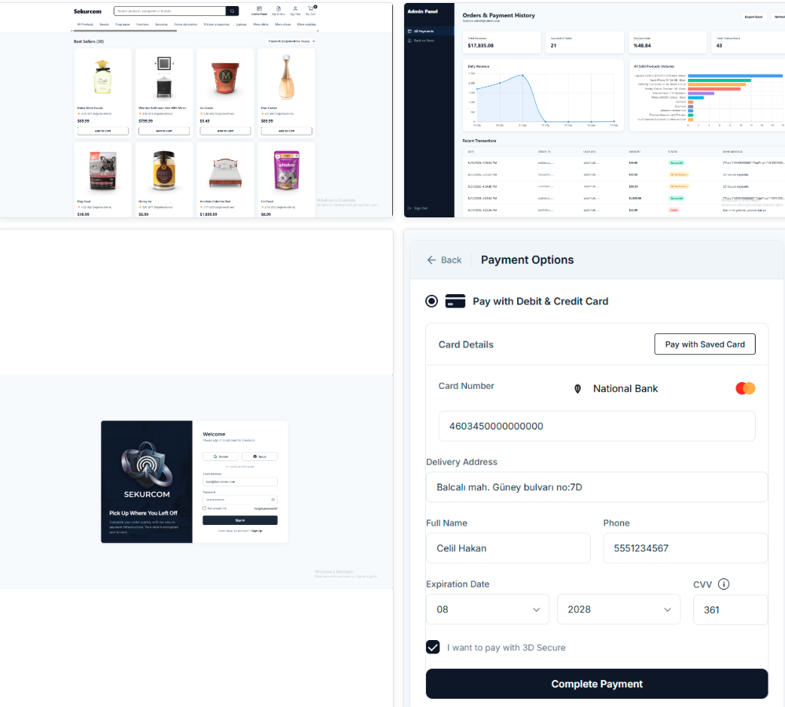
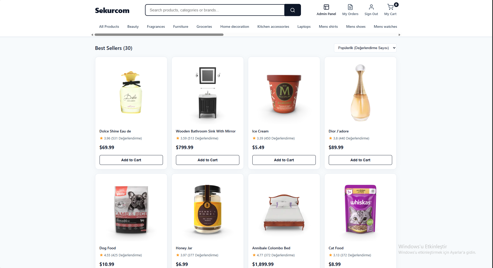
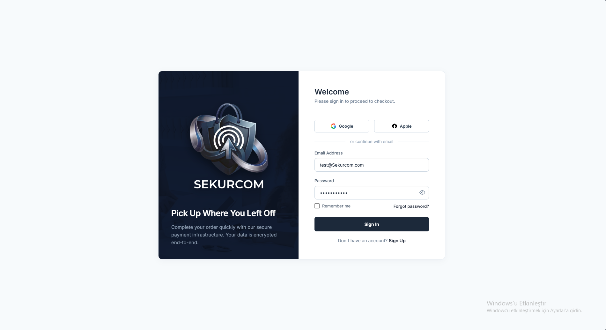
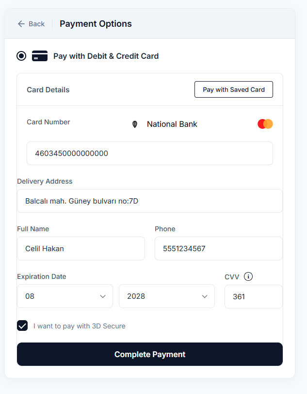
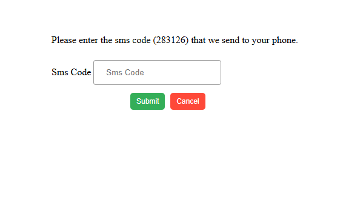
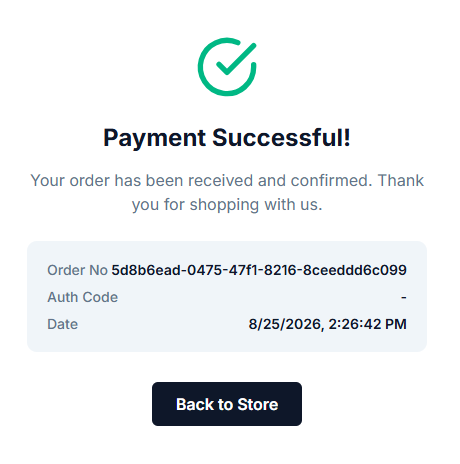
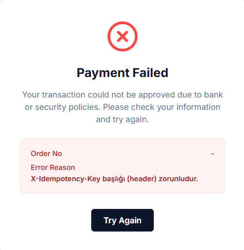
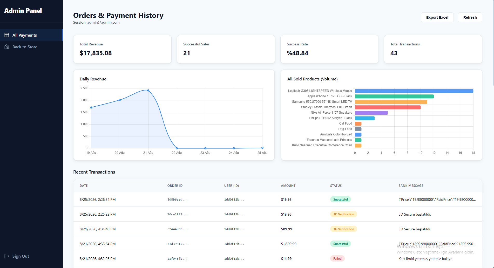
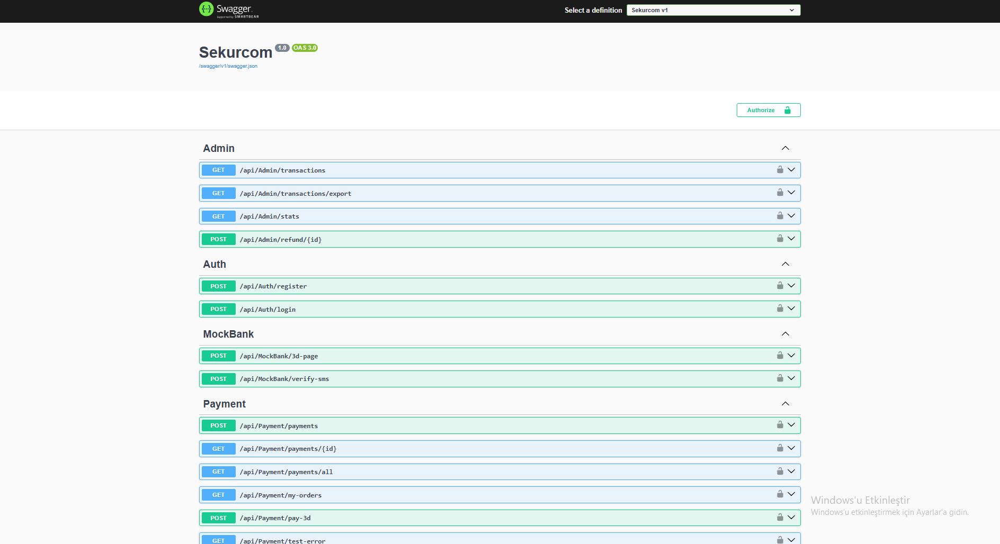
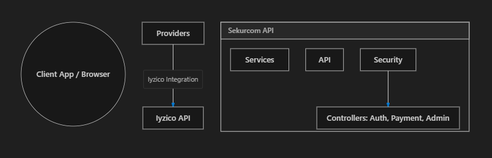

# Sekurcom — E-Commerce Payment API

A backend payment infrastructure built with ASP.NET Core (.NET 10) that integrates multiple payment providers under a single, unified interface. The project covers everything from 3D Secure flows and fraud detection to an admin dashboard with Excel export — basically what you'd need to wire up real payment processing for an e-commerce platform.

---

## Screenshots



### Store & Login
| | |
|---|---|
|  |  |

### Payment Flow
| Payment Form | 3D Secure SMS | Success | Fail |
|---|---|---|---|
|  |  |  |  |

### Admin Panel & API
| | |
|---|---|
|  |  |

### System Architecture


---

## What it does

The API handles the full lifecycle of a payment: a customer browses products, goes through a 3D Secure challenge (handled by Iyzico), the bank sends an async callback, the system finalizes the transaction, and the admin can view stats, issue refunds or export everything to Excel. A static HTML/JS frontend is included to demonstrate the complete flow end-to-end.

---

## Tech Stack

| Layer | Technology |
|---|---|
| Framework | ASP.NET Core Web API (.NET 10) |
| ORM | Entity Framework Core 10 (Code-First) |
| Database | PostgreSQL 16 |
| Containerization | Docker & Docker Compose |
| Authentication | ASP.NET Core Identity + JWT Bearer |
| Logging | Serilog (console + rolling file) |
| API Docs | Swagger / Swashbuckle |
| Excel Export | ClosedXML |
| Payment Provider | Iyzico (sandbox) |
| External Data | FakeStore API (product catalog) |

---

## Architecture

The project follows a layered architecture with a **Provider Pattern** at its core:

```
Controller → Service → IPaymentProvider → Iyzico / Ziraat
```

`IPaymentProvider` is an interface that defines the contract for any payment gateway. Switching from Iyzico to Ziraat Bank's virtual POS is a single line change in `Program.cs`. Both implementations handle:
- Direct payment (non-3D)
- 3D Secure initialization
- 3D Secure callback finalization
- Payment cancellation
- Refund processing

---

## Security Layers

A few things I was particularly careful about:

- **FraudProtectionMiddleware** — tracks request patterns per IP and card number. Too many attempts in a short window gets the source banned automatically.
- **Rate Limiting** — 50 requests/minute per IP using `FixedWindowRateLimiter`. Dropped before authentication to save CPU.
- **JWT with zero ClockSkew** — tokens expire the instant they should, no 5-minute Microsoft grace period.
- **Account lockout** — 5 failed password attempts triggers a 15-minute lock via ASP.NET Core Identity.
- **Idempotency filter** — prevents double charges from impatient double-clicks. Same request key = same response, no duplicate processing.

---

## Getting Started

### Prerequisites
- [.NET 10 SDK](https://dotnet.microsoft.com/download)
- [Docker Desktop](https://www.docker.com/products/docker-desktop/)

### 1. Start the database

```bash
docker compose up -d
```

This spins up PostgreSQL 16 and pgAdmin 4. pgAdmin is accessible at `http://localhost:5050`.

| Service | URL | Credentials |
|---|---|---|
| PostgreSQL | `localhost:5432` | `postgres / Sekurcom2026` |
| pgAdmin | `http://localhost:5050` | `admin@sekurcom.com / Admin123!` |

### 2. Run the API

```bash
dotnet run
```

On first launch, the app automatically runs migrations and seeds the database with test users and dummy transactions.

### 3. Open Swagger

```
http://localhost:{port}/swagger
```

---

## Seeded Test Accounts

| Role | Email | Password |
|---|---|---|
| Admin | `admin@admin.com` | `Admin123!` |
| Customer | `test@eticaret.com` | `Password123` |

---

## Core API Endpoints

| Method | Endpoint | Description | Auth |
|---|---|---|---|
| `POST` | `/api/auth/login` | Get JWT token | — |
| `POST` | `/api/auth/register` | Create account | — |
| `POST` | `/api/payment/pay-3d` | Start 3D Secure flow | Customer |
| `POST` | `/api/payment/callback` | Iyzico async callback | — |
| `GET` | `/api/payment/my-orders` | View own order history | Customer |
| `GET` | `/api/admin/transactions` | All transactions | Admin |
| `GET` | `/api/admin/transactions/export` | Download Excel report | Admin |
| `GET` | `/api/admin/stats` | Revenue, success rate, 7-day trend | Admin |
| `POST` | `/api/admin/refund/{id}` | Issue a refund | Admin |
| `GET` | `/api/products` | Product catalog (FakeStore API) | Customer |
| `POST` | `/api/webhook` | External payment notifications | — |

---

## Frontend Pages

Static HTML/CSS/JS pages served from `wwwroot/`:

- `store.html` — product listing and cart
- `payment.html` — card form and 3D Secure redirect
- `login.html` — sign in / register
- `admin.html` — dashboard with charts, transaction table, Excel export
- `my-orders.html` — customer order history
- `success.html` / `fail.html` — payment result pages

---

## Project Structure

```
Sekurcom/
├── Controllers/       # API endpoints
├── Services/          # Business logic layer
├── Providers/         # IPaymentProvider implementations (Iyzico, Ziraat)
├── Models/            # DTOs and domain models
├── Data/              # DbContext, migrations, seeder
├── Helpers/           # Middleware (fraud, exception handling), filters
├── Filters/           # Idempotency attribute
├── wwwroot/           # Static frontend pages
└── docker-compose.yml # PostgreSQL + pgAdmin setup
```

---

## Notes

- The Iyzico integration uses sandbox credentials. For production, replace keys in `appsettings.json` and point `BaseUrl` to the live endpoint.
- To switch to the Ziraat Bank provider, change one line in `Program.cs`:
  ```csharp
  // From:
  builder.Services.AddScoped<IPaymentProvider, IyzicoPaymentProvider>();
  // To:
  builder.Services.AddScoped<IPaymentProvider, ZiraatPaymentProvider>();
  ```
